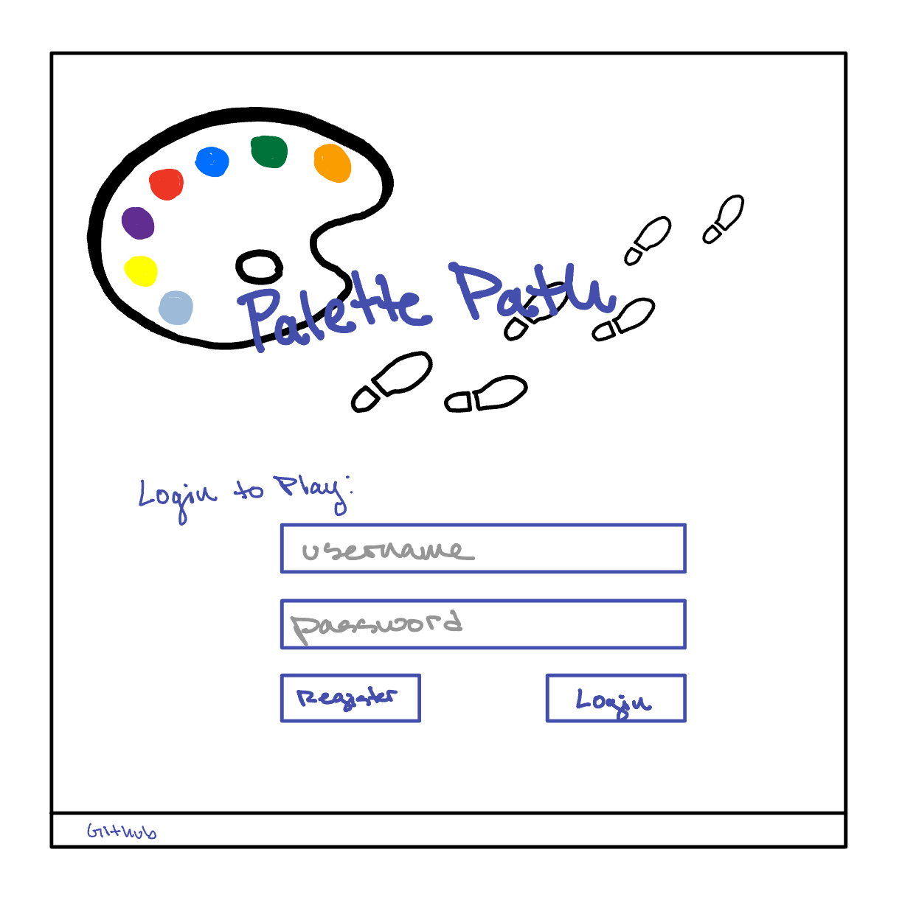
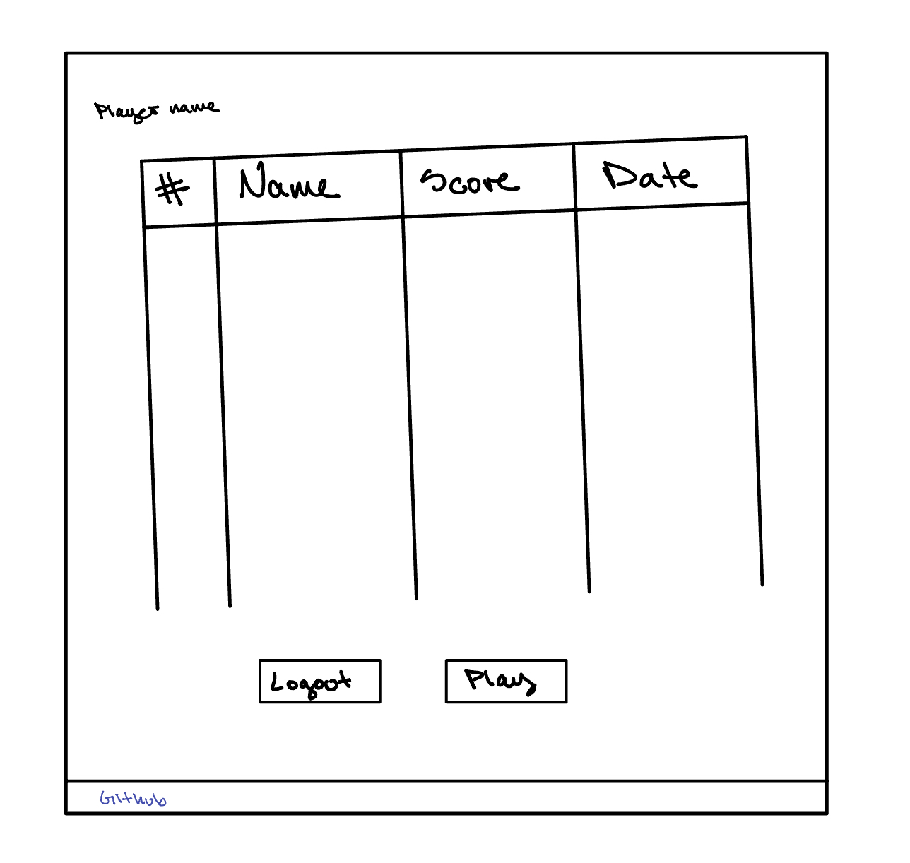
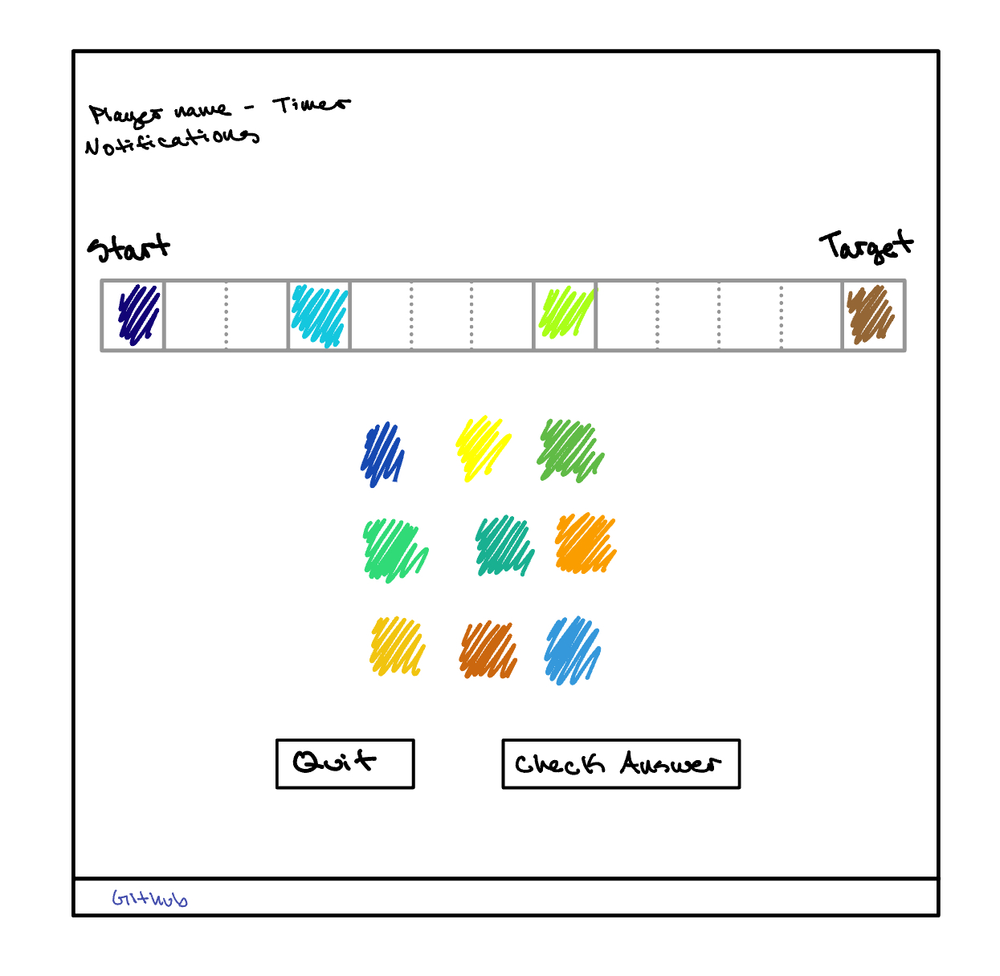
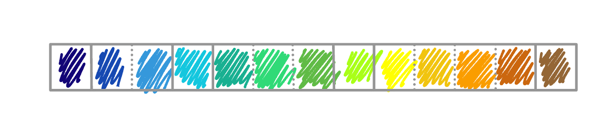

# startup
byu_fall24_cs260

Palette Path

# Specification Deliverable
  ## Elevator Pitch
  Embark of a colorful journey in **Palette Path**. Race to arrange your color pallete, transitioning from a set starting color to your target hue through a series of intermediate milestone colors. Each milestone must be passed in sequence, challenging your color navigation skils. How quickly can you paint your way to victory?

  ## Design
  Home/login page:
  
  Scores page:
  
  GamePlay page:
  
  Solution example:
  
  
  ## Key Features
  * User Authentication: Ability to register and log in, with data stored persistently
  * Scoreboard: Displays the current scoreboard with data persistently stored
  * User Actions: Ability to log out and start a new game
  * Gameplay Mechanics: Players can select colors, place colors, and check their answers
  * Real-time Updates: New scores are displayed in real-time
  * Game State Management: Ability to quit the game at any point

  ## Technologies
  I will use the required techologies in the following ways...
   ### HTML
   3 HTML pages: 
   1. Index.html as home/login page - links to scores page
   2. Scores.html to display scoreboard - links to home and gameplay pages
   3. GamePlay.html for gameplay - links to scores page
   Each page will hyperlink the github repository
   ### CSS
   Utilizes color and images to create a visually appealing design
   Responsive design that adapts to various screen sizes
   ### JavaScript/ React
   Provides register, login, logout, play, select color, place color, quit, check answer
   ### Service
   Backend service with endpoints for:
   * register
   * login
   * logout
   * play
   * get colors - use [ColourLovers](https://www.colourlovers.com/api)
   * quit
   * check solution
   ### Database
   Stores users and passwords
   Stores high scores and the users and the date they happened
   ### Login
   Scores and gameplay are accessible only to authenticated users
   ### Websocket
   As each user finishes, their score is broadcast to all other users

# HTML Deliverable

 I deployed simon to my production environment so it is accessable via simon.palettepath.click
 I also deployed my startup so it is accessable via https://startup.palettepath.click/

 For this deliverable I built out the structure of my application using HTML.
 * HTML pages: I made 3 html pages for home, scores, and gameplay
 * Structure: I organized consistently with appropriate tags
 * Links: github is linked to in every footer; links to all pages are in every header; links to pages are available when appropriate
 * Text and Images: All planned text and images are included
 * Placeholders: placeholders for other technology is included, such as
  - Login capability in index.html with username displayed in other pages
  - Database storage with register in index.html and scores in scores.html
  - Websockets with notifications in gameplay.html
  - 3rd party will be the data-colors in gameplay.html

# CSS Deliverable

I deployed simon's css to my production environent as well as my own startup css.

For this delieverable, I styled the application to its final appearance.
 * header, footer, and main styled primarily in index.css with adjustments as needed in scores.css and gameplay.css
 * navigation elements styled in the header to be recognizable
 * responsive to window resizing and adjusts as needed when portrait mode
 * application elements visually appealing with good whitespace and color
 * application text content visually appealing with good sizing and color
 * application imager placed and sized as needed

# React Deliverable

 * coverted the HTML/CSS code into a modern web application using Vite and React